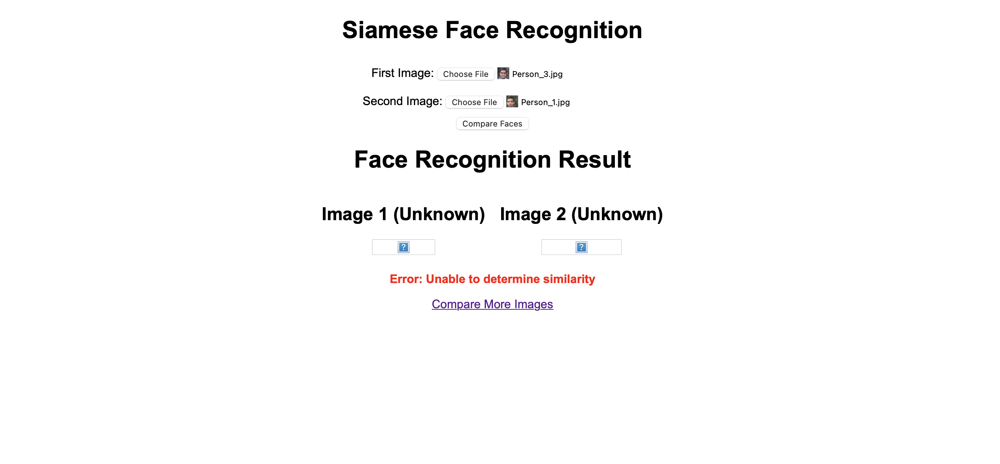
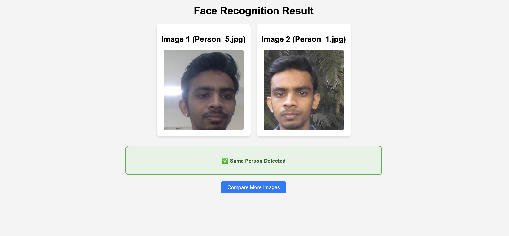
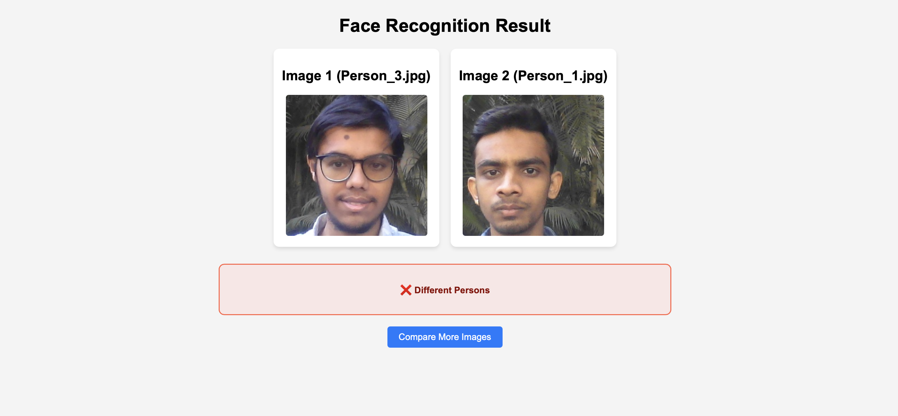

# Face Recognition System Using Siamese Network

A facial recognition system built with a Siamese neural network architecture that can verify if two face images belong to the same person. The system leverages the power of deep learning to create discriminative facial embeddings that can be compared for similarity.

## Project Overview

This project implements a facial recognition system with the following components:

- A Siamese neural network model for face verification
- Training pipeline with custom data augmentation and preprocessing
- Flask web application for real-time face comparison
- Model persistence and loading capabilities

## Siamese Network Architecture

The Siamese network architecture used in this project consists of:

### Embedding Network
- Input: RGB images (100x100x3)
- Convolutional layers with the following structure:
  - Conv2D(64, (10,10), activation='relu')
  - MaxPooling2D(64, (2,2), padding='same')
  - Conv2D(128, (7,7), activation='relu')
  - MaxPooling2D(64, (2,2), padding='same')
  - Conv2D(128, (4,4), activation='relu')
  - MaxPooling2D(64, (2,2), padding='same')
  - Conv2D(256, (4,4), activation='relu')
  - Flatten()
  - Dense(4096, activation='sigmoid')

### Distance Layer
- Custom L1 Distance layer that computes the absolute difference between two embedding vectors

### Output Layer
- Single neuron with sigmoid activation for binary classification (same/different person)

The model has approximately 39 million parameters, with the embedding network being the most parameter-heavy component.

## Training Data

The model is trained on:

1. **Anchor images**: Reference face images of the person (stored in data/anchor)
2. **Positive images**: Different images of the same person as in the anchor (stored in data/positive)
3. **Negative images**: Images of different people (stored in data/negative)

The training dataset leverages the Labeled Faces in the Wild (LFW) dataset for negative samples, which contains more than 13,000 images of faces collected from the web.

## Training Process

The model is trained using:
- Binary Cross-Entropy loss function
- Adam optimizer with learning rate of 1e-4
- Batch size of 16
- Data preprocessing including resizing to 100x100 and normalization

The training process creates positive pairs (anchor + positive) and negative pairs (anchor + negative) and trains the network to output values close to 1 for positive pairs and 0 for negative pairs.

## Web Application

The project includes a Flask web application that allows users to:
1. Upload two face images
2. Compare them using the trained Siamese model
3. Receive a prediction on whether they are the same person
4. View the confidence score for the prediction

### Application Screenshots

#### Main Page
The main interface allows users to upload two images for comparison:



#### Positive Result (Same Person)
When the system detects that both images belong to the same person:



*Example face used for positive match verification*

#### Negative Result (Different Persons)
When the system detects that the images belong to different people:



## Installation and Setup

### Prerequisites
- Python 3.8 or higher
- TensorFlow 2.10.0
- OpenCV 4.6.0
- Flask 2.1.0
- NumPy 1.23.4
- Werkzeug 2.1.1

### Installation

1. Clone the repository:
```bash
git clone https://github.com/yourusername/face-recognition-siamese.git
cd face-recognition-siamese
```

2. Install dependencies:
```bash
pip install -r requirements.txt
```

3. Run the Flask application:
```bash
python main.py
```

4. Open your web browser and navigate to `http://localhost:5000`

## Project Structure

- `face.ipynb`: Jupyter notebook containing the model development and training process
- `main.py`: Flask application for web-based face verification
- `siamesemodelv2.h5`: Pre-trained Siamese network model
- `data/`: Directory containing training images
  - `anchor/`: Reference face images
  - `positive/`: Different images of the same person
  - `negative/`: Images of different people
- `templates/`: HTML templates for the web application
- `static/`: Static files for the web application
- `lfw/`: Original Labeled Faces in the Wild dataset directory
- `Images/`: Screenshots and sample images showing the application in use

## Model Performance

The model achieves high accuracy on the test dataset with:
- High precision: Correctly identifying when two images are of the same person
- High recall: Minimizing false negatives, ensuring that matches are not missed

## Future Improvements

- Add face detection preprocessing to automatically crop and align faces
- Implement data augmentation techniques for improved robustness
- Explore different architecture variants to reduce model size
- Add user authentication and image storage
- Implement real-time face recognition from webcam

## License

This project is licensed under the MIT License - see the LICENSE file for details.

## Acknowledgments

- The Labeled Faces in the Wild dataset for providing diverse face images
- TensorFlow and Keras for the deep learning framework
- Flask for the web framework 